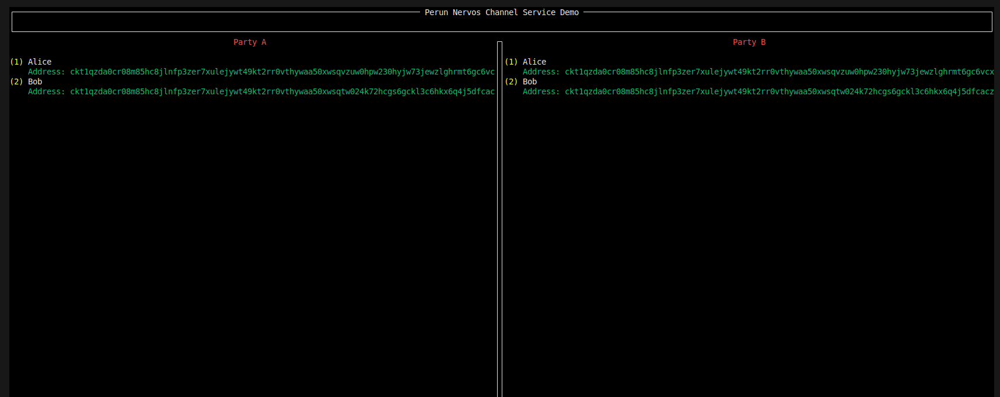
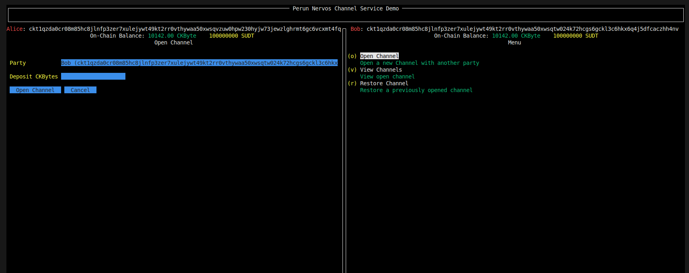
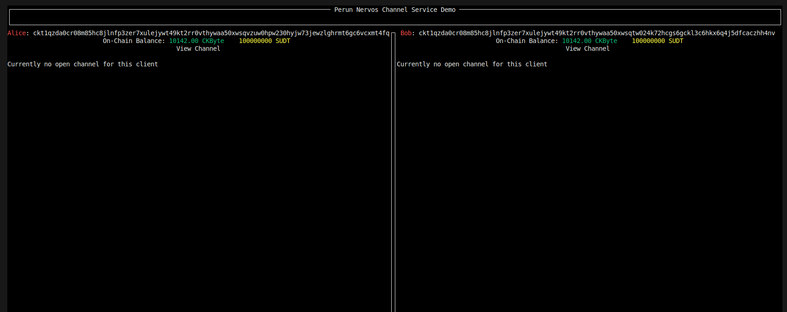
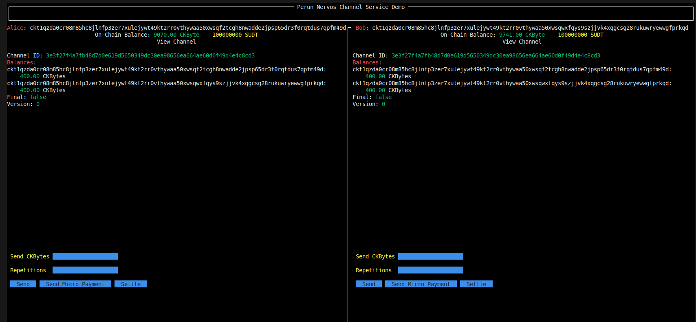
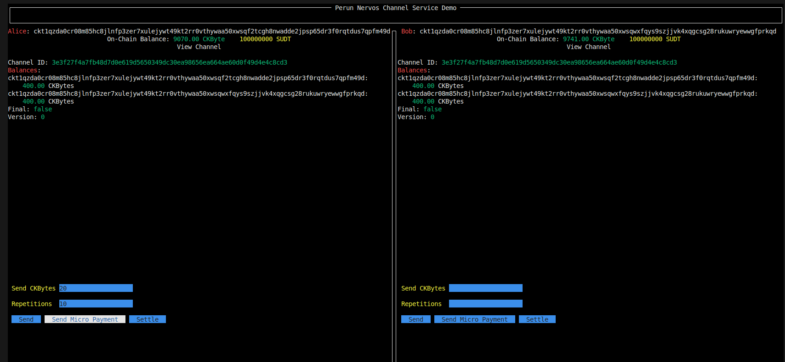
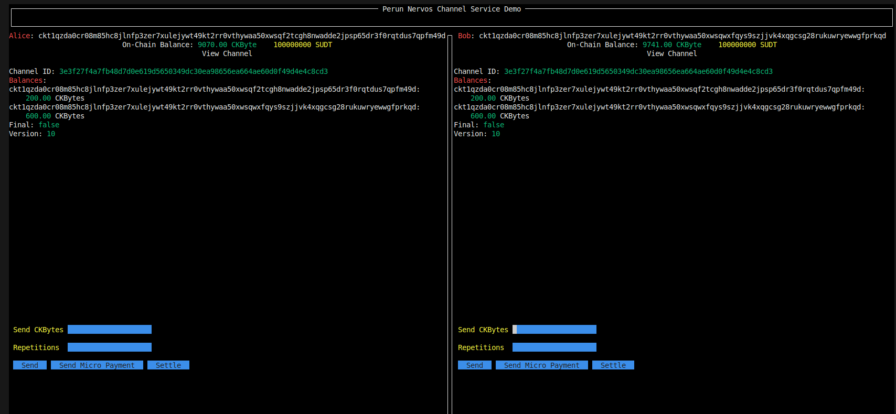
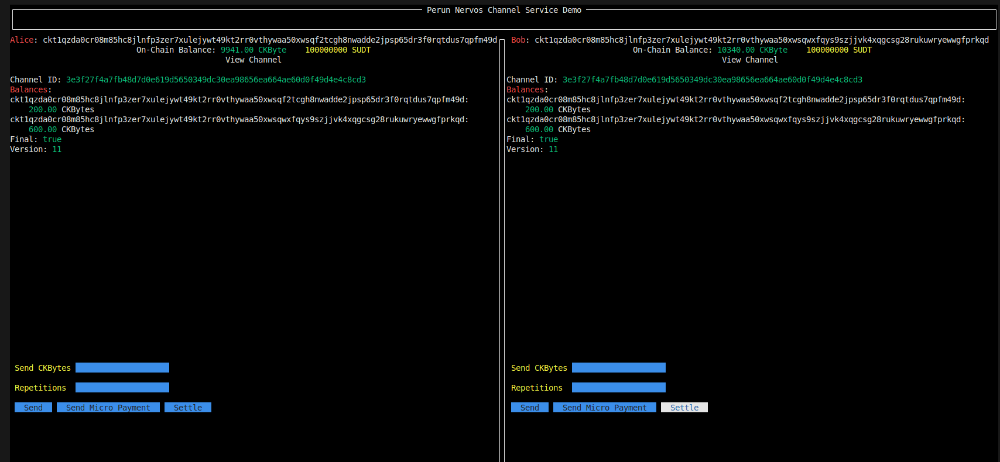
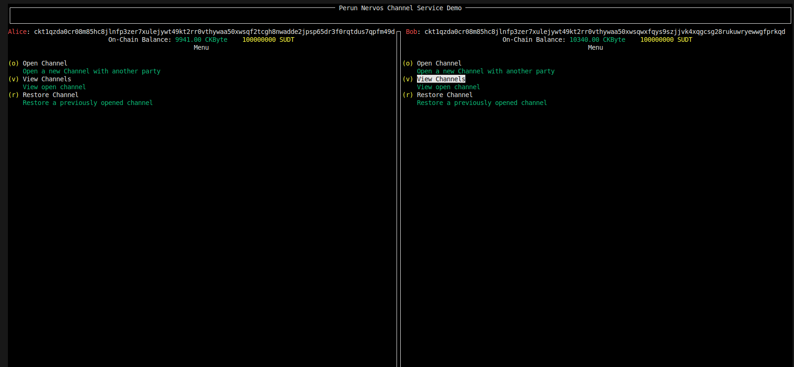
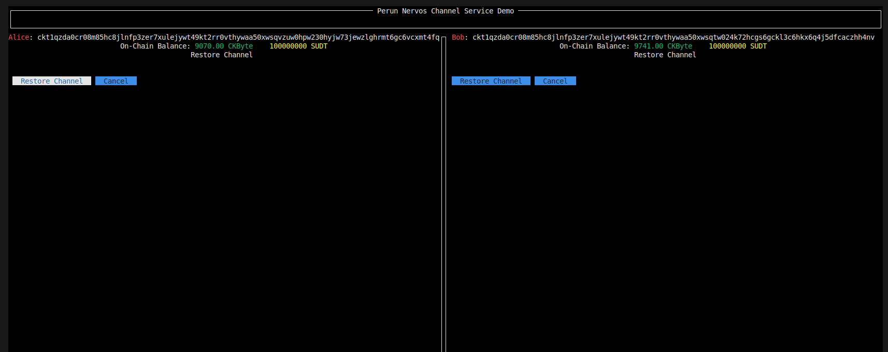
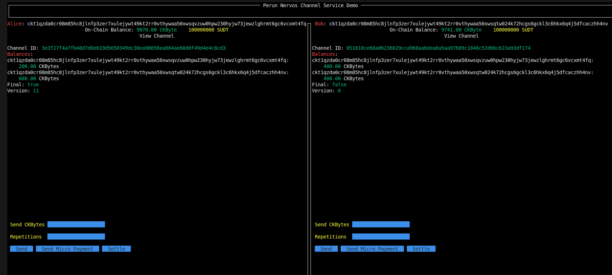

<h1 align="center" style="background-color: #f0f0f0;"><br>
    <a href="https://perun.network/"></a>
<br></h1>

<h2 align="center">PERUN NERVOS DEMO</h2>

This repository demonstrates the use of the CKB Wallet clients, which interact with a [Go-Perun](https://github.com/perun-network/go-perun)'s [channel service](https://github.com/perun-network/channel-service) server to establish a payment channel.

# Usage

## Dependencies

We use various tools to enable a convenient setup for the local development testnet. If you want to use our `setup-devnet.sh` script, make sure the following commandline tools are installed:
* `jq`:
  - Used to parse and edit some configuration files.
* `sed` and `awk`:
  - We modify some fields of the files generated by the `ckb init --chain dev` command using `sed` and `awk`.
* `tmux` and `tmuxp`:
  - `tmuxp` is a session manager for `tmux` that allows to easily create descriptive `.yaml` configuration files to create and attach to `tmux` sessions.
* `expect`:
  - We completely automize the process for test-wallet creation, deploying of contracts etc. To make this work reliably, we use `expect` which allows to describe how a commandline application is fed input.
* `make`:
  - Not strictly necessary, but it should be available on most systems by default. In case you do not want to install `make` check out the `Makefile` content and issue the command on your own.
* `ckb` with version `0.109.0` or higher.
* `ckb-cli` with version `1.4.0` or higher.
* `capsule` with version `0.9.2`.
* `docker` and a **running** `dockerd` instance!

# Setup

Clone this repository:

```
  $ git clone git@github.com:perun-network/perun-nervos-demo
```

Initiliaze `git` submodules and make sure all dependencies are installed.

```
  $ cd perun-nervos-demo
  $ git submodule update --init --recursive
```

Build the demo client:

```
  $ go build -o perun-nervos-demo
```

Spin up the local testnet. For this change to the `perun-nervos-demo/devnet` directory and issue the `make dev` command.
**NOTE**: Make sure you are in a terminal that is not already running within `tmux`. `make dev` will use this terminal window and create a `tmux` session.

```
  $ cd ./devnet
  $ make dev
```


Wait for ~15 seconds. This is the time it takes for the devnet setup to be completed (deployed all contracts, funded testnet accounts etc.).

Run the channel-service servers on another terminal:

```
  $ cd ./channel_service
  go run .
```


# Using The Demo

If you are comfortable using `tmux` you can of course use the `devnet` session, otherwise in a **new terminal window** start the `perun-nervos-demo`.
**NOTE**: Make sure you are in the root directory of the `perun-nervos-demo` repository.

```
  $ cd perun-nervos-demo/
  $ ./perun-nervos-demo
```

You will be greeted with a demo window that is split into two panes:




## Keybinds

* `ctrl+a`: Select left pane
* `ctrl+b`: Select right pane
* `tab`: Cycle through selectable fields
* `Enter`: Select or confirm highlighted field
* `r`: Go back to parent page
* `q`: Close the demo

## Example run

Let's use the left side for Alice and the right side for Bob:


We will use Bob to view the channels he has currently open with others and Alice to open a new channel with Bob.



We will use Alice to open a channel with 400 CKBytes.


After issuing the open transaction, we have to wait for it to be confirmed on-chain. Both parties will wait:



After a few seconds the transaction is confirmed on-chain and both parties were able to observe that fact. This will result in both Alice and Bob viewing the now offically established channel.



Let's use Alice to send ten micropayments of 20 CKBytes per payment to Bob via their channel.


****
We can observe the fact that multiple payments were issued by looking at the channels version number, which was incremented by ten, the amount of micropayments issued by Alice.



Now we use Bob to settle the channel.



After a few seconds the channels settlement is confirmed on-chain and we can view the updated balances for Bob and Alice.




## Restore Payment Channel
The database is store locally in `*-db` folders.

Simulate an event of channel service shut down by stopping the channel service and the demo service on the second and third terminals.

Restart the channel-services' terminal again.

```
  $ cd ./channel_service
  go run .
```

Restart Demo app.

```
./perun-nervos-demo
```

Navigate Restore the channel by selecting the `Restore Channel` button and confirm.



The old channel will be restored, identified by its ID.



**Note:** If you want to restart a fresh demo, you will need to delete the database folders `*-db` in `channel_service`